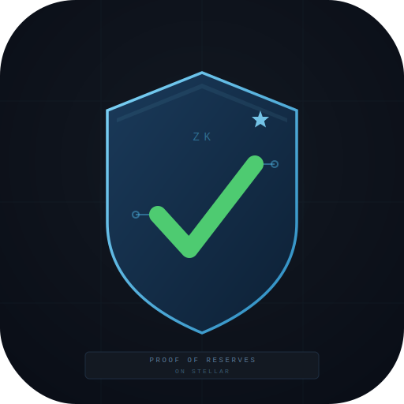

<div align="center">
  
  <h1>Proof of Reserves</h1>
  <p><strong>Zero-Knowledge Solvency Verification on Stellar</strong></p>
  <p>
    A stablecoin issuer proves their reserves cover all user liabilities —<br/>
    without revealing a single account balance.
  </p>
  <p>
    <a href="https://stellar.expert/explorer/testnet/contract/CDKOGVGTG7ODIPJ37KA5LQSUEQM63RIOSROVVBG7K34SBVQWOAIMKB4U">
      Live Contract on Stellar Testnet
    </a>
    &nbsp;·&nbsp;
    <a href="#quick-start">Quick Start</a>
    &nbsp;·&nbsp;
    <a href="#how-the-zk-works">How the ZK Works</a>
  </p>
  <p>
    Built for the <strong>Real-World ZK on Stellar</strong> hackathon — June 2026
  </p>
</div>

---

## The Problem

When a stablecoin or exchange holds customer funds, users have to trust the issuer. Publishing individual account balances would prove solvency — but at the cost of exposing every customer's financial data. Traditional audits are slow, expensive, and rely on trusting the auditor.

**There is a better way.**

## The Solution

This project uses a zero-knowledge proof to let an issuer prove:

> *"The sum of all private balances I hold equals exactly X — and my public reserve account covers X."*

The individual balances stay completely private. The proof is verified by a Soroban smart contract on Stellar using BN254 elliptic-curve operations introduced in Protocol 25/26. The solvency verdict — SOLVENT or INSOLVENT — is recorded permanently on-chain. No auditor. No trust. Math.

---

## Demo

**Deployed contract**: [`CDKOGVGTG7ODIPJ37KA5LQSUEQM63RIOSROVVBG7K34SBVQWOAIMKB4U`](https://stellar.expert/explorer/testnet/contract/CDKOGVGTG7ODIPJ37KA5LQSUEQM63RIOSROVVBG7K34SBVQWOAIMKB4U)  
**Network**: Stellar Testnet (Protocol 26)

The demo UI lets you:
1. Enter 5 Stellar testnet addresses — their XLM balances are fetched live from Horizon
2. Set a reserve balance to check solvency against
3. Click **Verify Solvency On-Chain** — the backend generates a fresh Groth16 proof and submits it to the contract
4. See **SOLVENT ✓** or **INSOLVENT ✗** with a link to the transaction on Stellar Expert

---

## Architecture

```
┌─────────────────────────────────────────────────────────────────┐
│                          ISSUER                                  │
│   Enters 5 Stellar account addresses (balances stay private)    │
└──────────────────────────┬──────────────────────────────────────┘
                           │
                           ▼
┌─────────────────────────────────────────────────────────────────┐
│                        FRONTEND                                  │
│   index.html — fetch balances, trigger proof, show result       │
└──────────┬────────────────────────────┬────────────────────────-┘
           │  POST /api/fetch-balances  │  POST /api/generate-proof
           │  POST /api/submit-proof    │  POST /api/fetch-reserve
           ▼                            ▼
┌─────────────────────────────────────────────────────────────────┐
│                     BACKEND (Express + snarkjs)                  │
│                                                                  │
│  1. Fetch live XLM balances from Stellar Horizon (5 accounts)   │
│  2. Run Groth16 fullProve() — private balances never leave here  │
│  3. Encode proof + call verify_solvency on the Soroban contract  │
└──────────────────┬──────────────────────────────────────────────┘
                   │
         ┌─────────┴──────────┐
         ▼                    ▼
  ┌─────────────┐    ┌──────────────────────────────────────────┐
  │ ZK CIRCUIT  │    │         SOROBAN CONTRACT                  │
  │ (Circom 2)  │    │  verify_solvency(proof, vk, liab, res)   │
  │             │    │                                           │
  │ Private in: │    │  1. Groth16 pairing check (BN254)        │
  │  balances[] │    │  2. reserve_balance >= total_liabilities  │
  │ Public out: │    │  3. Store SolvencyRecord on ledger        │
  │  totalLiab  │    │                                           │
  └─────────────┘    └──────────────────────────────────────────┘
```

---

## How the ZK Works

### The Circuit (`circuits/reserves.circom`)

The Circom circuit proves two things about the private inputs, without ever revealing them:

1. **Range validity** — every balance fits in 64 bits (non-negative, no overflow)
2. **Sum correctness** — the sum of all private balances equals the public `totalLiabilities`

```circom
template ProofOfReserves(N) {
    signal input  balances[N];       // PRIVATE: individual account balances
    signal output totalLiabilities;  // PUBLIC:  sum the issuer claims they owe

    // Prove each balance is non-negative (64-bit range check)
    component rangeCheck[N];
    for (var i = 0; i < N; i++) {
        rangeCheck[i] = Num2Bits(64);
        rangeCheck[i].in <== balances[i];
    }

    // Prove sum == totalLiabilities
    signal runningSum[N + 1];
    runningSum[0] <== 0;
    for (var i = 0; i < N; i++) {
        runningSum[i + 1] <== runningSum[i] + balances[i];
    }
    totalLiabilities <== runningSum[N];
}

component main = ProofOfReserves(5);
```

The circuit is compiled with Circom 2 and the proving key is generated from a Powers of Tau ceremony. Off-chain, `snarkjs.groth16.fullProve()` takes the private balances and produces a compact Groth16 proof (3 elliptic-curve points: π_A, π_B, π_C).

### The On-Chain Verifier (`contract/contracts/proof-of-reserves/src/lib.rs`)

The Soroban contract implements the Groth16 verification equation using Stellar's native BN254 host functions:

```
e(−A, B) · e(α, β) · e(vk_x, γ) · e(C, δ) == 1
```

Where `vk_x` is computed on-chain from the public input:

```
vk_x = IC[0] + totalLiabilities · IC[1]
```

This uses two Protocol 25/26 host functions — `bn254.g1_mul` and `bn254.g1_add` — before the final `bn254.pairing_check`. If the pairing holds **and** `reserve_balance >= total_liabilities`, the contract writes a `SolvencyRecord` to ledger storage and returns `true`.

### Why BN254 and Not Something Else?

BN254 is the curve that Circom and snarkjs target by default, and it's the same curve Ethereum uses for its ZK precompiles. Stellar Protocol 25 added native BN254 host functions specifically to make this class of proof verifiable on-chain without blowing the gas budget. Before Protocol 25, you would have had to implement elliptic-curve arithmetic inside a contract — prohibitively expensive.

---

## ZK Stack

| Layer | Tool |
|---|---|
| Circuit language | Circom 2 |
| Proof system | Groth16 |
| Proof generation | snarkjs (`groth16.fullProve`) |
| On-chain verifier | Soroban smart contract (Rust) |
| Elliptic curve | BN254 — Stellar Protocol 25/26 host functions |
| Hash (range checks) | `Num2Bits` from circomlib |
| Network | Stellar Testnet (Protocol 26) |

---

## Project Structure

```
proof-of-reserves/
├── circuits/
│   └── reserves.circom              # ZK circuit (5 private balances → total)
├── contract/
│   └── contracts/proof-of-reserves/
│       └── src/
│           ├── lib.rs               # Soroban verifier + solvency logic
│           ├── vk.rs                # Verification key as Rust byte arrays
│           └── test.rs              # Contract unit tests
├── frontend/
│   ├── index.html                   # Demo UI
│   └── logo.svg                     # App logo
├── scripts/
│   ├── server.js                    # Express backend (proof gen + contract calls)
│   ├── deploy.js                    # Deploy Soroban contract to testnet
│   ├── generate_proof.js            # Standalone proof generator
│   ├── verify_on_chain.js           # CLI: call verify_solvency directly
│   ├── topup_reserve.js             # Merge testnet accounts into a reserve
│   └── vk_to_rust.js                # Convert verification_key.json → vk.rs
├── keys/
│   ├── reserves_js/reserves.wasm   # Compiled circuit (witness generator)
│   ├── reserves_final.zkey          # Groth16 proving key
│   ├── verification_key.json        # Groth16 verification key
│   └── proof.json                   # Most recent generated proof (gitignored)
├── .env.example                     # Environment variable reference
└── railway.json                     # Railway deployment config
```

---

## Quick Start

### Prerequisites

- Node.js 18+
- A funded Stellar testnet account (or use the deployed contract as-is)

### 1. Clone and install

```bash
git clone https://github.com/Mystery-CLI/proof-of-reserves
cd proof-of-reserves
npm install
```

### 2. Configure environment

```bash
cp .env.example .env
```

Edit `.env`:

```
DEPLOYER_SECRET=S...   # Your Stellar testnet secret key
CONTRACT_ID=CDKOGVGTG7ODIPJ37KA5LQSUEQM63RIOSROVVBG7K34SBVQWOAIMKB4U
```

> Leave `CONTRACT_ID` as-is to use the already-deployed contract on testnet.  
> Get a free testnet account at [Stellar Lab](https://lab.stellar.org/) → Fund with Friendbot.

### 3. Run the server

```bash
npm start
# Server running at http://localhost:8080
```

Open `http://localhost:8080` and use the UI to verify solvency.

> **GitHub Codespaces**: the devcontainer starts the server automatically on port 8080 — no manual step needed. Just open the forwarded port.

---

## Generating a New ZK Proof

The server generates proofs dynamically for any 5 Stellar addresses you enter. You can also run the standalone generator:

```bash
node scripts/generate_proof.js
```

This reads 5 hardcoded balances, runs `snarkjs.groth16.fullProve`, and writes `keys/proof.json`. Proof generation takes ~20 seconds on a standard laptop — all the heavy math is off-chain.

---

## Rebuilding the Contract

The WASM is already compiled and the contract is deployed to testnet. To rebuild from source:

```bash
cd contract
cargo build --target wasm32v1-none --release -p proof-of-reserves
```

Requires Rust with:
```bash
rustup target add wasm32v1-none
```

To redeploy a fresh instance:
```bash
node scripts/deploy.js
# Writes new contract ID to keys/contract_id.txt and frontend/contract_id.txt
```

---

## Deploying to Railway

The backend is a standard Express app — deploy it to [Railway](https://railway.app) with two steps:

1. Connect your GitHub repo in the Railway dashboard
2. Set environment variables: `DEPLOYER_SECRET` and `CONTRACT_ID`

Railway auto-detects the `start` script from `package.json` and `railway.json` handles the rest. See [`.env.example`](.env.example) for all variables.

---

## Known Limitations

| Limitation | Notes |
|---|---|
| Fixed at 5 accounts | Circuit hardcoded to `N=5` — expandable by changing the template parameter and redoing the trusted setup |
| VK passed as call parameter | In production, embed it in contract storage at deploy time instead |
| Testnet only | Contracts use real BN254 host functions — the same ones on mainnet, but no real funds are at risk |
| Not audited | Research prototype — do not use with real assets |

---

## Hackathon

**Event**: [Real-World ZK on Stellar](https://stellarhacks.com)  
**Track**: Open innovation  
**Deadline**: June 29, 2026, 12:00 PM PST  
**Prize pool**: $10,000 in XLM  

This project targets the **"Proof-of-reserves for an issuer"** use case — a stablecoin or RWA issuer proving solvency thresholds on-chain without exposing account-level detail. The ZK is load-bearing: without it, the issuer would have to either reveal all balances or ask users to trust them.
